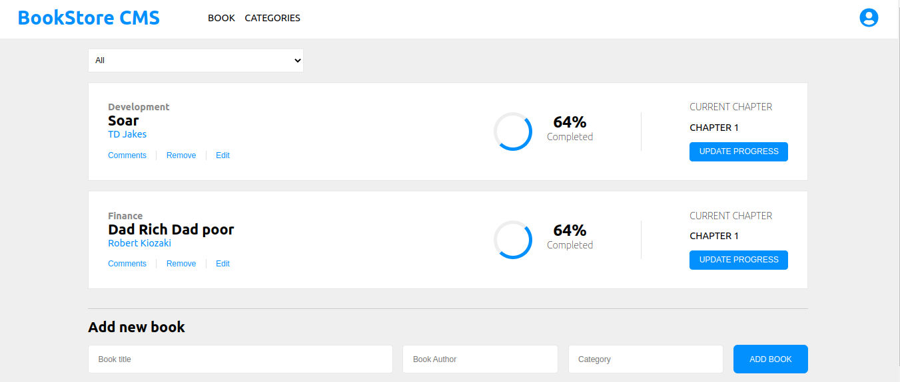

# Bookstore

> This is a front-end of an application that will help organize and manage bookstore. It is so fast, dynamic and responsive to actions and it is built with React & Redux including an API.



## Built With

- React
- JavaScript
- CSS
- JSX

## Live Demo (if available)

[Live Demo Link](https://livedemo.com)

### Getting Started

To get a local copy up and running follow these simple example steps.

- Clone the project unto your local machine using the link below
```bash
https://github.com/iambenkis/Bookstore-App.git
```
- Open the project with your code editor
- Run `npm install` to install all the dependencies
- Run `npm start` to start the server
- Open [http://localhost:3000](http://localhost:3000) to view it in the browser.

## Authors

👤 **Benjamin Kisenge (Me)**

* GitHub: [@benjamin kisenge](https://github.com/iambenkis)
* Twitter: [@benjamin kisenge](https://twitter.com/iambenkis)
* LinkedIn: [benjamin kisenge](https://www.linkedin.com/in/ben-kisenge/)

## 🤝 Contributing

Contributions, issues, and feature requests are welcome!

Feel free to check the [issues page](https://github.com/iambenkis/Bookstore-App/issues).

## Show your support

Give a ⭐️ if you like this project!

## Acknowledgments

- Microverse
-  Zeplin

## 📝 License

The MIT License (MIT)

Copyright (c) 2022